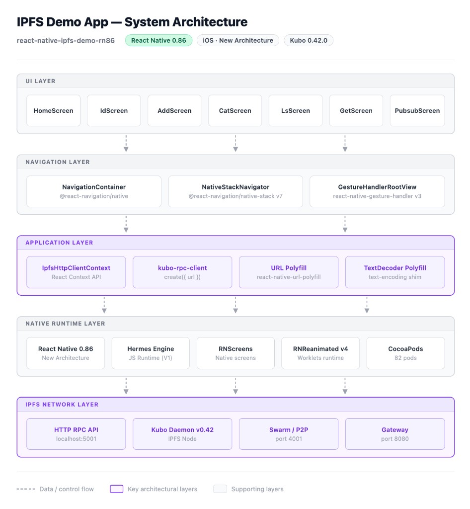

# IPFS Demo — React Native 0.86

A React Native mobile app that demonstrates how **IPFS (InterPlanetary File System)** works on a mobile device. IPFS is a decentralised, peer-to-peer protocol for storing and sharing files — instead of fetching data from a central server, files are identified by their content (a CID) and can be retrieved from any peer on the network.

This app connects to a locally running **IPFS Kubo daemon** via its HTTP RPC API and lets you interact with it directly from your iOS or Android device — no backend, no server, pure peer-to-peer from mobile.

Upgraded from the original [ipfs-shipyard/react-native-ipfs-demo](https://github.com/ipfs-shipyard/react-native-ipfs-demo) (React Native 0.63) to **React Native 0.86** with a fully modernised dependency stack.

---

## Demo Video

[](https://www.youtube.com/shorts/CegvpoL__JI)

---

## System Architecture



---

## Features

| Screen | What it does |
|---|---|
| **ID** | Fetch your IPFS node's identity — Peer ID, agent version, protocol version, and listen addresses |
| **Add** | Add text or binary data to IPFS. Returns a CID (content address) you can share with anyone on the network |
| **Cat** | Read and display content from IPFS by providing a CID |
| **LS** | List all files and folders inside an IPFS directory by CID |
| **Get** | Download a complete file tree from IPFS by CID |
| **PubSub** | Real-time messaging — connect to a peer, subscribe to a topic, and publish messages across the network |

---

## Usage

Each screen is a self-contained demo:
1. Make sure your IPFS daemon is running (see setup below)
2. Open the app — tap any operation from the Home screen
3. Hit the button — result appears on screen instantly
4. For **PubSub**, you need a second IPFS peer to connect to

---

## What Was Upgraded

| Package | Before | After |
|---|---|---|
| React Native | 0.63.4 | 0.86.0 |
| React | 16.9.0 | 19.2.3 |
| IPFS client | `ipfs-http-client` | `kubo-rpc-client` |
| Navigation | `@react-navigation/stack` v5 | `native-stack` v7 |
| Reanimated | v1 | v4 |
| Polyfills | 3 patch files | clean shims, zero patches |

---

## Prerequisites

- Node.js >= 22
- Xcode 16+ (iOS)
- CocoaPods
- IPFS Kubo daemon running locally

---

## Setup & Run

**1. Install dependencies**
```sh
npm install
cd ios && pod install && cd ..
```

**2. Configure IPFS daemon CORS (first time only)**
```sh
ipfs config --json API.HTTPHeaders.Access-Control-Allow-Origin '["*"]'
ipfs config --json API.HTTPHeaders.Access-Control-Allow-Methods '["PUT", "POST", "GET"]'
```

**3. Start IPFS daemon**
```sh
ipfs daemon
```

**4. Start Metro (new terminal)**
```sh
npx react-native start
```

**5. Run on iOS (another terminal)**
```sh
npx react-native run-ios
```
